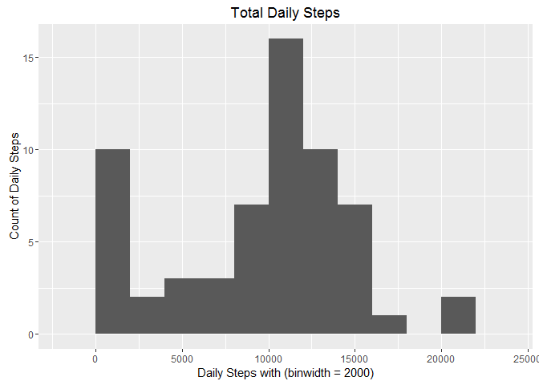

# PA1_template.Rmd
Hassan Rabie  
February 7, 2016  

 title: "Reproducible Research: Course Project1"
 

## A->Loading the data preprocessing

```r
#After downloading the date to the working directory, (1)we load it from the file activity.csv, transform date column as date 

df <- read.csv("activity.csv")
df$date <- as.Date(df$date)
```


## Q1->What is mean total number of steps taken per day?

```r
#Histogram shows the total number of steps taken in each day
#Load the library ggplot2 to draw histogram
library(ggplot2)
```

```
## Warning: package 'ggplot2' was built under R version 3.2.3
```

```r
TotalSteps <- aggregate(x = df$steps , by = list(df$date), FUN = sum ,na.rm=TRUE)
names(TotalSteps) <- c("date","steps")
HistogramPlot <- ggplot(TotalSteps,aes(x = steps)) +
            ggtitle("Total Daily Steps") +
            xlab("Daily Steps with (binwidth = 2000)") + ylab("Count of Daily Steps") +
            geom_histogram(binwidth = 2000)
HistogramPlot
```

 

```r
#Calculating the mean total number of steps taken per day
mean(TotalSteps$steps)
```

```
## [1] 9354.23
```

```r
#Calculatin the median total number of steps taken per day
median(TotalSteps$steps)
```

```
## [1] 10395
```

## Q2->What is the average daily activity pattern?

```r
#Make a time series plot of 5-minute interval and the average number of steps taken, averaged across all days
AVGSteps<- aggregate(x = df$steps , by = list(df$interval), FUN = mean ,na.rm=TRUE)
names(AVGSteps) <- c("interval","steps")

TimeSeriesPlot <- ggplot(AVGSteps,aes(interval,steps)) +
                 ggtitle("Time Series Plot of Average Steps by Interval") +
                 geom_line()
TimeSeriesPlot
```

 

```r
#The 5-min time interval contains the maximum number of steps?
AVGSteps[which.max(AVGSteps$steps),c("interval")]
```

```
## [1] 835
```

## Q3->Imputing missing values

```r
 #Calculating total number of missing values in the dataset
  nrow(df[is.na(df$steps),])
```

```
## [1] 2304
```

```r
#imputing missing step values with mean step at time interval
df.imputed <- merge(x = df, y = AVGSteps, by = "interval", all.x = TRUE)
df.imputed[is.na(df.imputed$steps.x),c("steps.x")] <- df.imputed[is.na(df.imputed$steps.x),c("steps.y")]

#cleaning data
df.imputed$date <- as.Date(df.imputed$date)
df.imputed$date.x <- NULL
df.imputed$Group.1 <- NULL
df.imputed$steps <- df.imputed$steps.x
df.imputed$steps.x <- NULL
df.imputed$steps.y <- NULL

#Histogram with new dataframe
TotalSteps <- aggregate(x = df.imputed$steps , by = list(df.imputed$date), FUN = sum ,na.rm=TRUE)
names(TotalSteps) <- c("date","steps")
HistogramPlot <- ggplot(TotalSteps,aes(x = steps)) +
            ggtitle("Daily steps after Imputation") +
            xlab("Steps (binwidth 2000)") +
            geom_histogram(binwidth = 2000)
HistogramPlot 
```

 

```r
#mean total number of steps taken per day
mean(TotalSteps$steps)
```

```
## [1] 10766.19
```

```r
#median total number of steps taken per day
median(TotalSteps$steps)
```

```
## [1] 10766.19
```

## Q3->Are there differences in activity patterns between weekdays and weekends?

```r
#Create a new factor variable - "weekday" and "weekend" indicating whether a given date is a weekday or weekend day.
df.imputed$weekday <- as.factor(ifelse(weekdays(df.imputed$date) %in% c("Saturday","Sunday"), "Weekend", "Weekday")) 

AVGWeekday  <- aggregate(x = df.imputed$steps , by = list(df.imputed$interval,df.imputed$weekday), FUN = mean ,na.rm=TRUE)
names(AVGWeekday) <- c("interval","weekday","steps")

#Make a panel plot containing a time series plot of the 5-minute interval and the average number of steps taken 
#averaged across all weekday days or weekend days.
AVGPlotline <- ggplot(AVGWeekday,aes(interval,steps)) +
                 ggtitle("Time Series Plot of Average Steps by Interval after Imputation") +
                 facet_grid(. ~ weekday) +
                 geom_line(size = 1)
AVGPlotline
```

 

